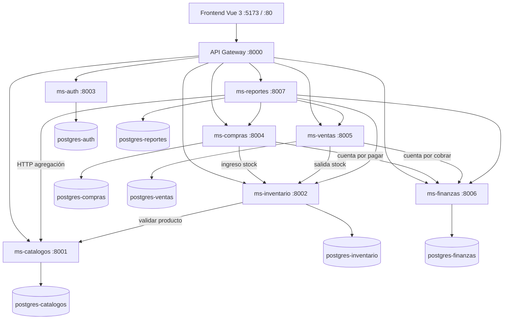

# Arquitectura Micro MVP (actualizada)

## Diagrama general



## Microservicios y puertos

| Servicio | Puerto | Base de datos |
|----------|--------|---------------|
| api-gateway | 8000 | — |
| ms-catalogos | 8001 | postgres-catalogos :5432 |
| ms-inventario | 8002 | postgres-inventario :5433 |
| ms-auth | 8003 | postgres-auth :5434 |
| ms-compras | 8004 | postgres-compras :5435 |
| ms-ventas | 8005 | postgres-ventas :5436 |
| ms-finanzas | 8006 | postgres-finanzas :5437 |
| ms-reportes | 8007 | postgres-reportes :5438 |
| frontend | 5173 (dev) / 80 (docker) | — |

## Enrutamiento API Gateway

| Ruta pública | Destino |
|--------------|---------|
| `/compras/*` | ms-compras |
| `/ventas/*` | ms-ventas |
| `/finanzas/*` | ms-finanzas |
| `/reportes/*` | ms-reportes |
| `/catalogos/*` | ms-catalogos |
| `/inventario/*` | ms-inventario |
| `/auth/*` | ms-auth |

Todas las rutas (excepto login/refresh/register/health) requieren JWT Bearer.

## Estructura por microservicio

```
ms-{nombre}/
├── Dockerfile
├── requirements.txt
├── db/
│   └── init.sql
└── app/
    ├── main.py
    ├── seed.py              # opcional
    ├── core/
    │   ├── config.py
    │   └── database.py
    ├── models/
    ├── schemas/
    ├── crud/
    ├── routers/
    ├── services/            # lógica de negocio e integraciones
    └── enums/               # opcional
```

## Comunicación inter-servicios

| Origen | Destino | Acción |
|--------|---------|--------|
| ms-compras | ms-inventario | POST `/stock/ingreso` al recepcionar |
| ms-compras | ms-finanzas | POST `/cuentas-por-pagar` al recepcionar |
| ms-ventas | ms-inventario | POST `/stock/salida` al confirmar venta |
| ms-ventas | ms-finanzas | POST `/cuentas-por-cobrar` al facturar |
| ms-reportes | varios | GET agregación de reportes |
| ms-inventario | ms-catalogos | Validar producto |

## Levantar el stack

```bash
cp .env.example .env
docker compose up -d --build
```

Frontend en Docker: http://localhost:5173  
API Gateway: http://localhost:8000  
Login demo: `admin` / `Admin123456`

---

## Ejemplos cURL (vía API Gateway)

Obtener token:

```bash
TOKEN=$(curl -s -X POST http://localhost:8000/auth/login \
  -H "Content-Type: application/json" \
  -d '{"username":"admin","password":"Admin123456"}' | jq -r .access_token)
AUTH="Authorization: Bearer $TOKEN"
```

### ms-compras

```bash
# Listar proveedores
curl -s http://localhost:8000/compras/proveedores -H "$AUTH"

# Crear proveedor
curl -s -X POST http://localhost:8000/compras/proveedores -H "$AUTH" -H "Content-Type: application/json" \
  -d '{"codigo":"PROV-TEST","nombre":"Proveedor Test","activo":true}'

# Listar órdenes de compra
curl -s http://localhost:8000/compras/ordenes -H "$AUTH"

# Aprobar orden
curl -s -X POST http://localhost:8000/compras/ordenes/1/aprobar -H "$AUTH"

# Registrar recepción
curl -s -X POST http://localhost:8000/compras/recepciones -H "$AUTH" -H "Content-Type: application/json" \
  -d '{"orden_id":1,"almacen_id":1,"detalles":[{"producto_id":1,"cantidad":"5"}]}'
```

### ms-ventas

```bash
# Listar clientes
curl -s http://localhost:8000/ventas/clientes -H "$AUTH"

# Listar ventas
curl -s http://localhost:8000/ventas/ventas -H "$AUTH"

# Confirmar venta
curl -s -X POST http://localhost:8000/ventas/ventas/1/confirmar -H "$AUTH"

# Crear factura
curl -s -X POST http://localhost:8000/ventas/facturas -H "$AUTH" -H "Content-Type: application/json" \
  -d '{"venta_id":1,"impuesto":"0"}'
```

### ms-finanzas

```bash
# Cuentas por cobrar / pagar
curl -s http://localhost:8000/finanzas/cuentas-por-cobrar -H "$AUTH"
curl -s http://localhost:8000/finanzas/cuentas-por-pagar -H "$AUTH"

# Registrar cobro
curl -s -X POST http://localhost:8000/finanzas/cobros -H "$AUTH" -H "Content-Type: application/json" \
  -d '{"cuenta_cobrar_id":1,"monto":"500","metodo":"EFECTIVO"}'

# Cajas y bancos
curl -s http://localhost:8000/finanzas/cajas -H "$AUTH"
curl -s http://localhost:8000/finanzas/bancos -H "$AUTH"
```

### ms-reportes

```bash
curl -s http://localhost:8000/reportes/stock -H "$AUTH"
curl -s http://localhost:8000/reportes/kardex/producto/1 -H "$AUTH"
curl -s http://localhost:8000/reportes/compras -H "$AUTH"
curl -s http://localhost:8000/reportes/ventas -H "$AUTH"
curl -s http://localhost:8000/reportes/finanzas -H "$AUTH"
curl -s "http://localhost:8000/reportes/exportar/excel?tipo=stock" -H "$AUTH" -o reporte.csv
```

## Frontend

```
frontend/src/
├── services/   compras | ventas | finanzas | reportes
├── types/      compras | ventas | finanzas | reportes
└── views/
    ├── compras/
    ├── ventas/
    ├── finanzas/
    └── reportes/
```

Desarrollo local del frontend:

```bash
cd frontend && npm install && npm run dev
```

Variable `VITE_API_BASE_URL=http://localhost:8000`
