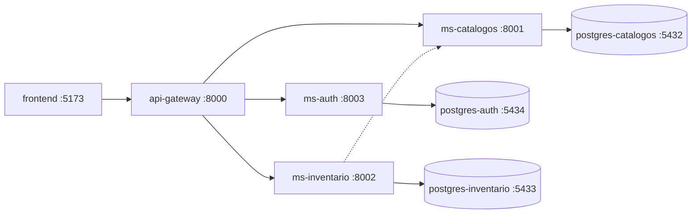

# micro-mvp

MVP de microservicios con API Gateway, autenticación JWT, catálogos, inventario y panel administrativo web.

El frontend **solo consume el API Gateway** (`http://localhost:8000`). Los microservicios internos no se exponen directamente al cliente.

## Arquitectura



| Componente            | Puerto | Descripción                                      |
|-----------------------|--------|--------------------------------------------------|
| `frontend`            | 5173   | Panel admin Vue 3 (login, CRUD, inventario)      |
| `api-gateway`         | 8000   | Punto de entrada, proxy reverso y validación JWT |
| `ms-auth`             | 8003   | Login, refresh, usuarios, roles y permisos       |
| `ms-catalogos`        | 8001   | Categorías, marcas, unidades de medida, productos |
| `ms-inventario`       | 8002   | Almacenes, existencias, movimientos y stock      |
| `postgres-auth`       | 5434   | Base de datos de autenticación                   |
| `postgres-catalogos`  | 5432   | Base de datos de catálogos                       |
| `postgres-inventario` | 5433   | Base de datos de inventario                      |

## Stack tecnológico

### Backend
- **FastAPI** + **SQLAlchemy async** + **PostgreSQL 16**
- **PyJWT** en el gateway para validar tokens
- **Docker Compose** para orquestación

### Frontend
- **Vue 3** + **TypeScript** + **Vite**
- **Vuetify 3** (UI)
- **Pinia** (estado)
- **Vue Router** (rutas protegidas)
- **Axios** (HTTP + refresh token automático)

## Requisitos

- Docker y Docker Compose
- Node.js 18+ y npm (solo para el frontend en desarrollo)

## Inicio rápido

### 1. Backend (Docker)

```bash
cp .env.example .env
docker compose up --build
```

Servicios backend:

| URL | Descripción |
|-----|-------------|
| http://localhost:8000 | API Gateway (único punto de consumo) |
| http://localhost:8000/health | Health check del gateway |
| http://localhost:8003/docs | Swagger ms-auth (directo, solo dev) |
| http://localhost:8001/docs | Swagger ms-catalogos (directo, solo dev) |
| http://localhost:8002/docs | Swagger ms-inventario (directo, solo dev) |

### 2. Frontend (desarrollo local)

```bash
cd frontend
cp .env.example .env
npm install
npm run dev
```

Panel admin: **http://localhost:5173**

### Credenciales demo (seed)

| Campo      | Valor           |
|------------|-----------------|
| Usuario    | `admin`         |
| Contraseña | `Admin123456`   |

## API Gateway — rutas expuestas

Todas las rutas protegidas requieren header `Authorization: Bearer <access_token>`.

### Auth (`/auth/*` → ms-auth)

| Método | Ruta | Auth | Descripción |
|--------|------|------|-------------|
| POST | `/auth/login` | No | Iniciar sesión |
| POST | `/auth/refresh` | No | Renovar access token |
| POST | `/auth/logout` | Sí | Cerrar sesión |
| GET | `/auth/me` | Sí | Usuario autenticado |
| GET | `/auth/usuarios` | Sí | Listar usuarios |
| GET | `/auth/roles` | Sí | Listar roles |
| GET | `/auth/permisos` | Sí | Listar permisos |

### Catálogos (`/catalogos/*` → ms-catalogos)

| Recurso | Endpoints |
|---------|-----------|
| Categorías | `GET/POST /catalogos/categorias`, `PUT/DELETE /catalogos/categorias/{id}` |
| Marcas | `GET/POST /catalogos/marcas`, `PUT/DELETE /catalogos/marcas/{id}` |
| Unidades de medida | `GET/POST /catalogos/unidades-medida`, `PUT/DELETE /catalogos/unidades-medida/{id}` |
| Productos | `GET/POST /catalogos/productos`, `PUT/DELETE /catalogos/productos/{id}` |

### Inventario (`/inventario/*` → ms-inventario)

| Recurso | Endpoints |
|---------|-----------|
| Almacenes | `GET/POST /inventario/almacenes`, `PUT/DELETE /inventario/almacenes/{id}` |
| Existencias | `GET /inventario/existencias`, `GET .../producto/{id}`, `GET .../almacen/{id}` |
| Movimientos | `GET /inventario/movimientos` |
| Kardex | `GET /inventario/kardex/producto/{producto_id}` |
| Stock | `POST /inventario/stock/ingreso`, `salida`, `ajuste`, `transferencia` |

## Frontend — módulos implementados

| Módulo | Vistas |
|--------|--------|
| **Auth** | Login con JWT (access + refresh token) |
| **Dashboard** | Resumen: productos, almacenes, stock bajo, movimientos |
| **Catálogos** | CRUD categorías, marcas, unidades de medida, productos |
| **Inventario** | CRUD almacenes, existencias, movimientos, kardex, ingreso/salida/ajuste/transferencia |
| **Seguridad** | Consulta de usuarios, roles y permisos |

### Características del frontend

- Layout admin con sidebar, topbar y diseño responsive
- Interceptor Axios con **refresh token automático** en respuestas 401
- Pinia store de autenticación y snackbar global
- Rutas privadas con guard de navegación
- Tablas con búsqueda, paginación, dialogs CRUD y confirmación de eliminación

## Flujo de autenticación

```
1. POST /auth/login  →  access_token + refresh_token
2. Frontend guarda tokens en localStorage
3. Axios adjunta Authorization: Bearer <access_token>
4. Gateway valida JWT antes de proxyear a microservicios
5. Si token expira (401) → POST /auth/refresh → reintenta petición
6. Si refresh falla → logout y redirección a /login
```

## Variables de entorno

Copia `.env.example` a `.env` en la raíz del proyecto. **No subas `.env` al repositorio.**

Variables principales:

| Variable | Descripción |
|----------|-------------|
| `JWT_SECRET` | Secreto compartido entre ms-auth y api-gateway |
| `JWT_ALGORITHM` | Algoritmo JWT (default: `HS256`) |
| `CORS_ORIGINS` | Orígenes permitidos (incluye `http://localhost:5173`) |
| `ACCESS_TOKEN_EXPIRE_MINUTES` | Expiración del access token |
| `REFRESH_TOKEN_EXPIRE_DAYS` | Expiración del refresh token |

Frontend (`frontend/.env`):

```env
VITE_API_BASE_URL=http://localhost:8000
```

## Estructura del proyecto

```
micro-mvp/
├── api-gateway/          # Proxy reverso + middleware JWT
├── ms-auth/              # Autenticación, usuarios, roles, permisos
├── ms-catalogos/         # Categorías, marcas, productos, UOM
├── ms-inventario/        # Almacenes, existencias, movimientos, stock
├── frontend/             # Panel admin Vue 3 + Vuetify
│   ├── src/
│   │   ├── components/   # Sidebar, Topbar, BaseDataTable, etc.
│   │   ├── layouts/        # AuthLayout, AdminLayout
│   │   ├── views/          # Login, Dashboard, CRUD, Inventario, Seguridad
│   │   ├── services/       # Axios + servicios API
│   │   ├── stores/         # Pinia (auth, app)
│   │   ├── router/         # Rutas y guards
│   │   └── types/          # TypeScript interfaces
│   └── .env.example
├── docker-compose.yml
└── .env.example
```

## Comandos útiles

```bash
# Backend — levantar servicios
docker compose up --build

# Backend — detener
docker compose down

# Frontend — desarrollo
cd frontend && npm run dev

# Frontend — build producción
cd frontend && npm run build

# Ver logs de un servicio
docker compose logs -f api-gateway
```

## Roles y permisos (seed)

| Rol | Descripción |
|-----|-------------|
| `ADMIN` | Acceso total |
| `OPERADOR` | Catálogos e inventario (crear/consultar) |
| `CONSULTA` | Solo lectura en catálogos e inventario |

El usuario `admin` tiene rol **ADMIN** con todos los permisos asignados.

## Notas de desarrollo

- El gateway rechaza peticiones sin token en rutas protegidas (`/catalogos/*`, `/inventario/*`, `/auth/me`, etc.).
- `ms-inventario` consulta `ms-catalogos` internamente para validar productos.
- Los seeds de base de datos son idempotentes y se ejecutan al inicializar los contenedores PostgreSQL.
- En producción, cambia `JWT_SECRET` y usa HTTPS.
